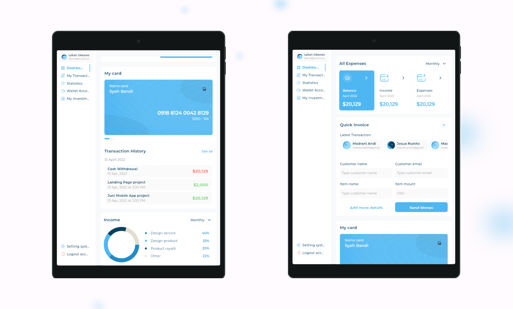
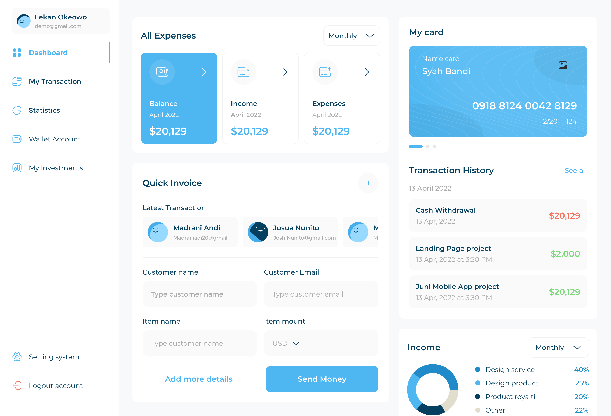

# Responsive & Adaptive Admin Dashboard UI

## Overview

This project focuses on creating a responsive and adaptive admin dashboard UI using Flutter. It utilizes various widgets and techniques to ensure a seamless user experience across different screen sizes and devices.

## Key Widgets and Techniques

- **MediaQuery:** Obtains screen height and width to adapt the UI based on the device's context.
  
- **LayoutBuilder:** Constructs a widget tree that adjusts based on the parent widget's size, enabling adaptive layouts.

- **Expanded:** Expands a child widget to fill available space along the main axis in Row, Column, or Flex layouts.

- **Flexible:** Controls how a child widget flexes within a limited space, if it has fixed size and there isn't available space for it then widget flexe in the available space.

- **FittedBox:** Fits its child widget to a specific size given by the parent widget.

- **AspectRatio:** Sizes the child widget to a specific aspect ratio (width / height), maintaining visual consistency.

- **IntrinsicHeight & IntrinsicWidth:** Allow child widgets to determine their own height or width based on intrinsic dimensions, preventing content overflow.

## Screenshots

### iPhone

### Samsung

### iPad

### Web

